# ⭐Vision of SSA.zip

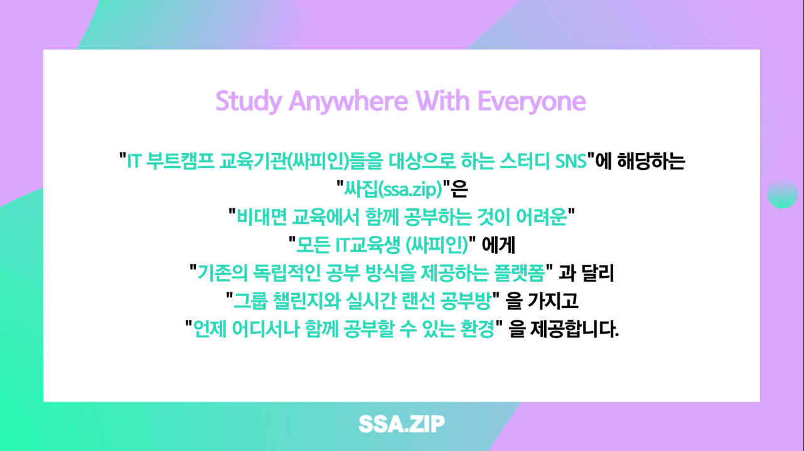

 

 

 

# 🌞Study Anywhere With Everyone

- What is SSAZIP?

  > SSAZIP은 IT 교육생이 자유롭게 스터디를 구성하고, 함께 공부할 수 있는 웹 서비스 환경을 제공합니다.

 

- 챌린지형 스터디 시스템(Challenge-Type Study System)

  > 함께 진행하는 챌린지를 형성하여 단기 스터디를 모집할 수 있고, 해당 스터디를 검색하여 참여도 가능합니다.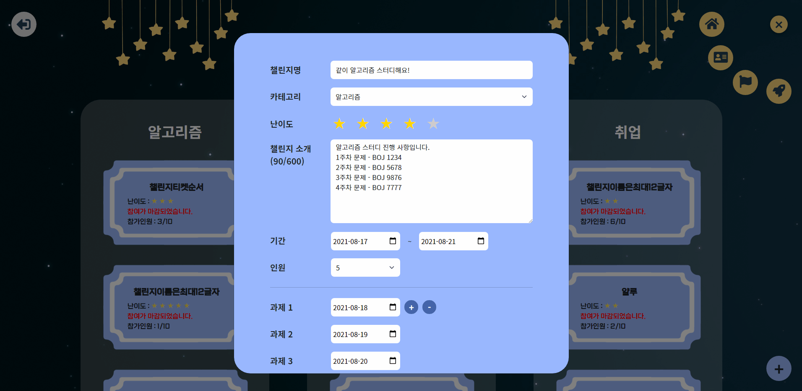
  >
  > 

   

  > 해당 챌린지에 참여하여 과제를 제출할 수 있고, 서로의 과제를 열람할 수 있습니다.
  >
  > 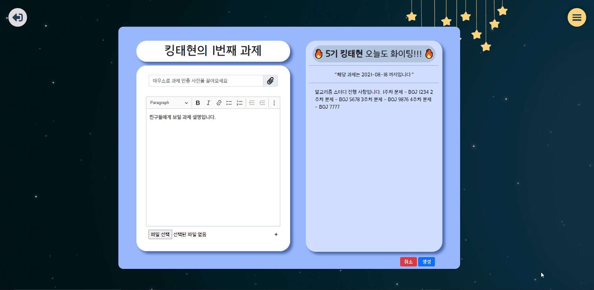
  >
  > 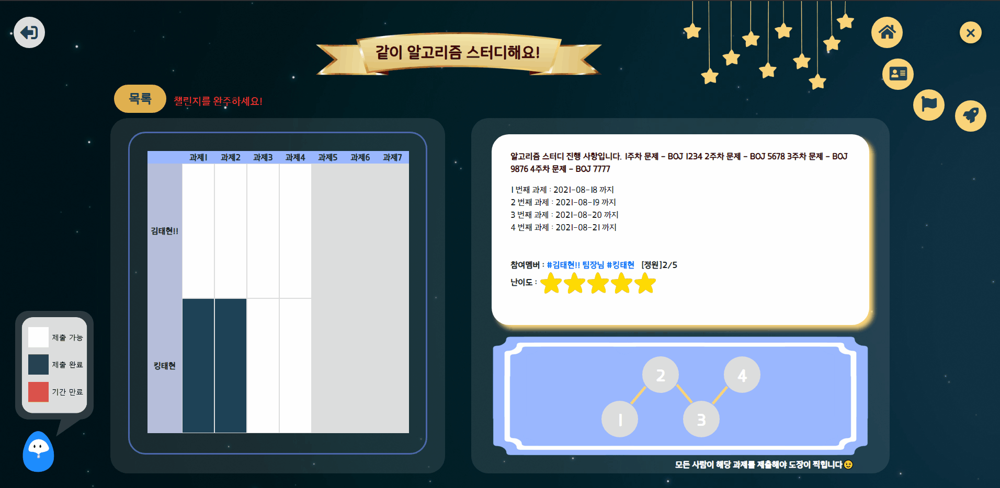

   

  > 각 챌린지는 프로필 피드에 기록되어 원할 때 확인할 수 있습니다.
  >
  > 

 

- 실시간 모각코 시스템(Real-time Self-coding System)

  > 실시간으로 공부중인 사람과, 공부 시간을 확인할 수 있습니다. 또한, 공부 시간이 높은 순서대로 랭킹이 화면 가운데 별자리 형태로 표시됩니다.
  
   
  
  > 채팅방 입퇴장시 랜덤 알림이 발생하고, 채팅방을 변경해가며 사람들과 채팅이 가능합니다.
  
   
  
  > 1시간 간격으로 공부방에서 공부를 지속하고 있는지 여부를 체크합니다.
  >
  > 

 

- 피드

  > 피드에서 친구의 활동 사항(팔로우, 챌린지 도전, 모각코 방 입장 등...)들을 알 수 있고, 해당 친구의 활동 및 프로필을 조회할 수 있습니다.
  >
  > 

   

  > 명예의 전당에서는 주간 공부 관련된 활동을 적극적으로 한 친구들을 확인할 수 있고, 해당 친구의 프로필을 조회할 수 있습니다.
  >
  > 

   

- 프로필

  > 프로필 편집이 가능합니다.
  >
  > 

   

  > 관심 인물을 팔로우할 수 있으며, 팔로워와 팔로잉 목록을 확인할 수 있습니다.
  >
  > 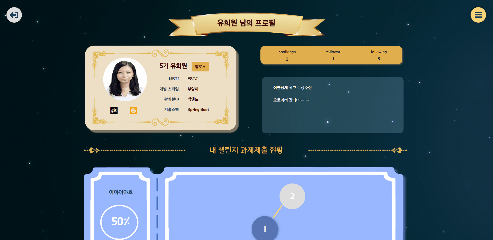

   

# ✏About Project

> ### Term : `2021.07.12 ~ 2021.08.20`

> ### Organization : 삼성 청년 소프트웨어 아카데미 5기 / 2학기 공통 프로젝트 서울 3반 7팀

> ### Team
>
> - 이장섭 : Back-End Developer, Project Manager
> - 권희은 : Front-End Developer
>
> - 김준형 : Front-End Developer
>
> - 김태현 : Back-End Developer
> - 유희원 : Back-End Developer
> - 차은채 : Front-End Developer

   

# 📆Release Planning

### 1 ~ 2주차

1. 기획
2. 설계
3. 환경설정

### 3주차

1. **기본 웹 기능으로 사이트를 이용 할 수 있다.**  ⇒ 15 | 30
2. **팔로우 팔로잉 기능으로 관계 형성이 가능하다.** ⇒ 5 | 5
3. **그룹 챌린지로 함께 도전과제를 공유하며 수행 할 수 있다.**  ⇒ 25  | 15

### 4주차

1. **프로필로 자신의 활동내역과 정보를 공유 할 수 있다.** ⇒ 20 | 5
2. **피드로 유용한 정보를 실시간으로 얻을 수 있다.** ⇒ 20 | 30
3. **명예의 전당으로 동기부여 될 정보를 얻을 수 있다.** ⇒ 2 | 3

### 5주차

1. **랜선 공부방으로 실시간 공부 유저와 함께 할 수 있다.** ⇒ 25  |  40
2. **DM 기능과 접속자 확인 기능으로 서로 소통이 가능하다.** ⇒ 20 | 15

### 6주차

1. 배포 ⇒ 10
2. 발표
3. 영상 제작

 

### Burndown Charts for Reference!

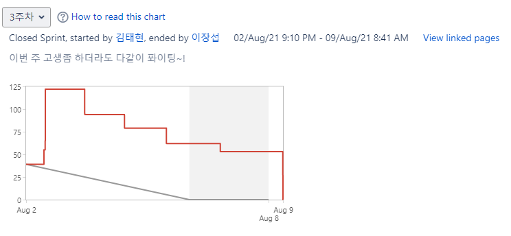

​	

 

 

 

# ⚙Project Architecture

- ER-Diagram 1, 2 ⇒ https://drive.google.com/file/d/14gTkbjaci8I0HUJZfaLf-nSaZJLiHl5p/view?usp=sharing
  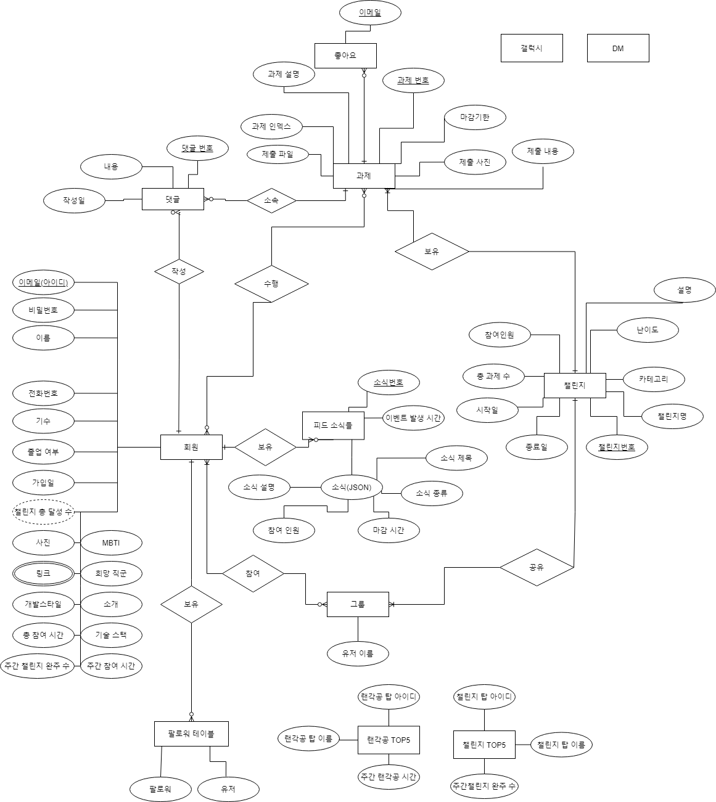

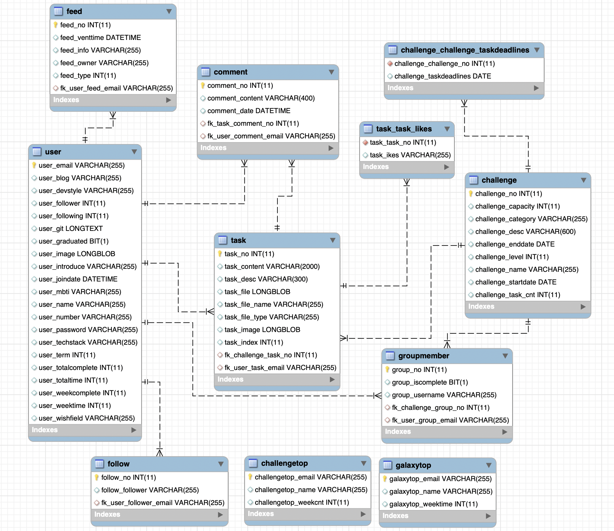

 

- API Architecture ⇒ swagger-ui.html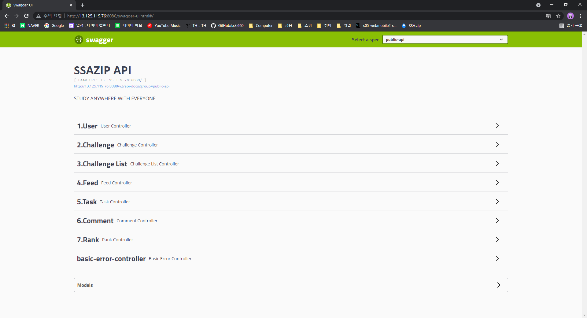

 

- Wireframe 1, 2 ⇒ https://www.figma.com/file/uvFIvJ3ZjaqAQgNQ8ypIbk/SSAZIP?node-id=17%3A2
  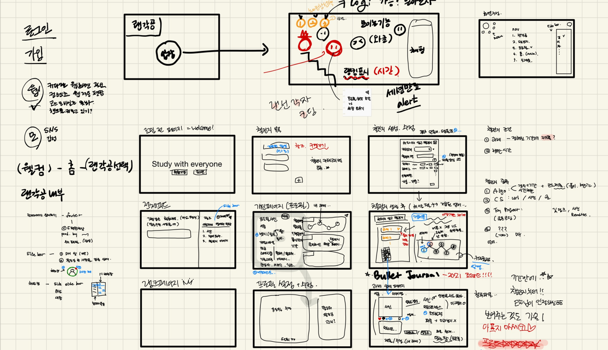

  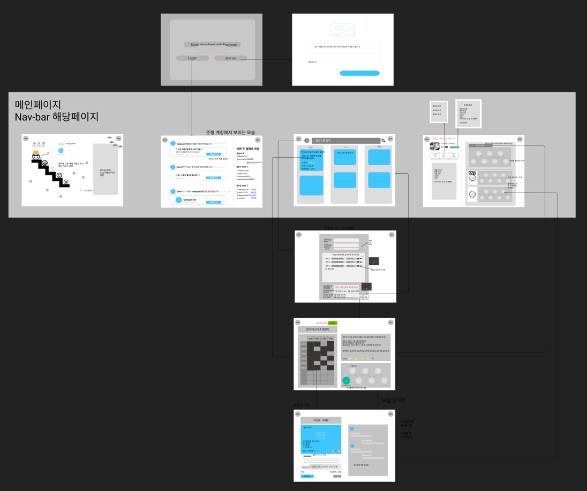

 

- Prototype ⇒ https://www.figma.com/file/uvFIvJ3ZjaqAQgNQ8ypIbk/SSAZIP?node-id=1%3A2
  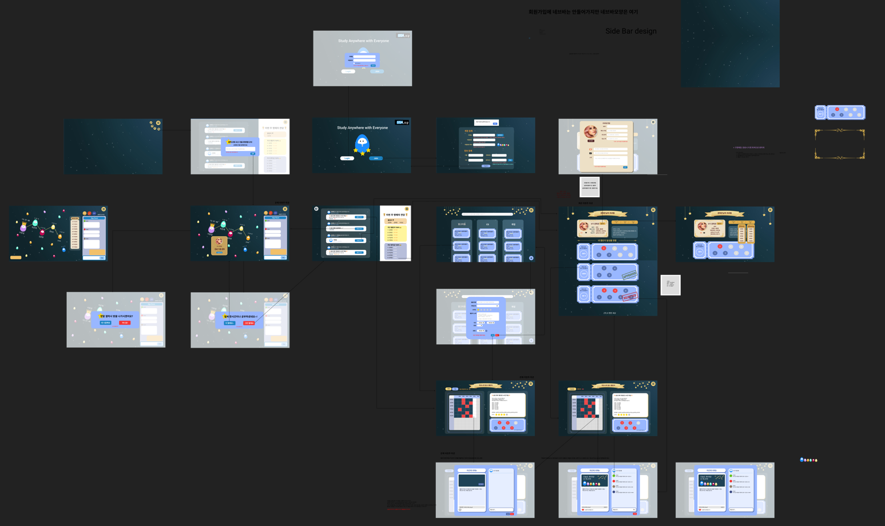

 

- Component Architecture ⇒ https://www.figma.com/file/uvFIvJ3ZjaqAQgNQ8ypIbk/SSAZIP?node-id=1%3A2
  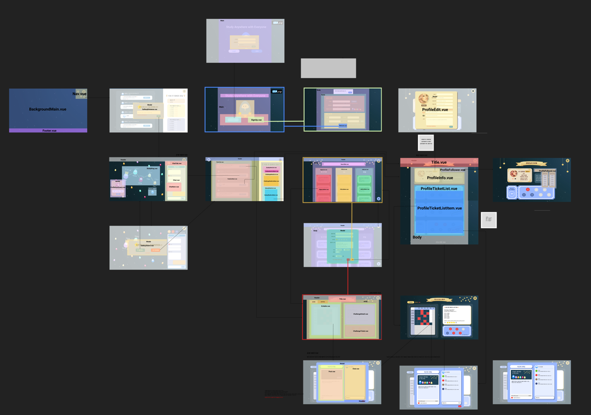

 

 

 

# 📚Documents

- 문서 작성
  - 마크다운 기본 문법
- 개발 환경
  - AWS EC2 Server
    - 기본 서버 구축
    - GUI 기반 서버 관리(Jupyter Notebook)
    - Ubuntu Firewall
    - 클라우드 컴퓨팅이란?
  - Docker
    - Docker 설치
    - Docker를 사용한 Vue CLI Project 배포
    - Docker를 사용한 Maria Database 구축
    - Docker를 사용한 Spring boot Project 배포
  - Jenkins
    - Docker를 사용한 Jenkins 설치 및 Docker in Docker 구조
    - Front-End Project 배포 자동화
    - Back-End Project 배포 자동화
  - 기타
    - 클라우드 컴퓨팅이란?
    - Docker란 무엇인가?
    - Kubernetes란 무엇인가?

- Web Socket
  - Http 통신의 한계
  - Web Socket이란?
  - SockJS, STOMP

- Front-End
  - Vuex
    - Vuex란?
    - Vuex 환경 설정
    - 상태 관리 패턴

- Back-End
  - Spring Framework?
  - DTO, VO, DAO?
  - REST API
  - Lombok
  - JPA
  - CORS

   

# 📋Conference Log

 <a href="./conference/firstMeeting.md">사전 회의 - Basic Rules</a>

 <a href="./conference/secondMeeting.md">1차 회의 - 기획</a>

 <a href="./conference/thirdMeeting.md">2차 회의 - 기획</a>

 <a href="./conference/forthMeeting.md">3차 회의 - 기술 조사</a>

 <a href="./conference/fifthMeeting.md">4차 회의 - 기술 명세</a>

 <a href="./conference/sixthMeeting.md">5차 회의 - 아이디어</a>

 <a href="./conference/seventhMeeting.md">6차 회의 - 아이디어</a>

 <a href="./conference/eighthMeeting.md">7차 회의 - Scrum</a>

 <a href="./conference/ninthMeeting.md">컨설팅 내역</a>

 <a href="./conference/tenthMeeting.md">2차 발표 준비</a>

 

 

 

# 💡Usage

## Sample URL
> http://i5a307.p.ssafy.io/

## Vue Project
### Project setup
> npm install

### Compiles and minifies for production
> npm run build

### Compiles and hot-reloads for development
> npm run serve

## Spring Boot Project
### Compiles and minifies for production
> ./gradlew build

### Compiles and hot-reloads for development
> java -jar SSAZIPtest-0.0.1-SNAPSHOT.jar

   

# 🌏Environment
## FrontEnd
### IDE         
- Visual Studio Code 1.59.0

### JavaScript
- Node.js 14.16.0

 

## BackEnd
### IDE
- Intellij IDEA 2021.1.3(Ultimate Edition)

### Java
- OpenJDK 11.0.1

### Spring Boot
- spring boot 2.5.3
- Gradle 7.1.1

 

## Database
- MySQL 15.1 Distrib 10.6.3-MariaDB, for debian-linux-gnu

 

## Infra
- Ubuntu 20.04 LTS
- Docker 20.10.7
- Jenkins 2.304

 

## Properties
- Database : 13.125.119.76:3306 (아이디: ssafy, 비밀번호: SSAZIPA307)
- 서버 주소(Jupyter Nodebook) : https://13.125.119.76:8888 (비밀번호: SSAZIPA307)
- 젠킨스 주소 : http://13.125.119.76:9090/ (아이디: sskl660 비밀번호: SSAZIPA307)

 

## 사용 협업 툴
- 회의 : Webex, Zoom, Discord
- 이슈 트래킹 : JIRA
- 대화 : Slack
- 문서 : Notion
- 디자인 : Figma

 

