# 📝 Scenario

---

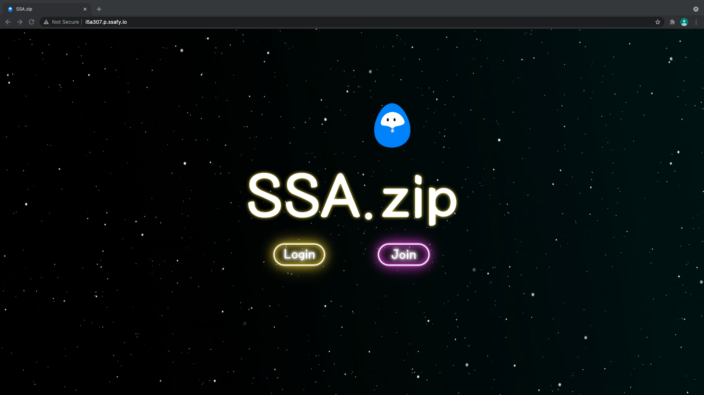

- 첫 페이지

  회원가입 또는 로그인을 할 수 있습니다.

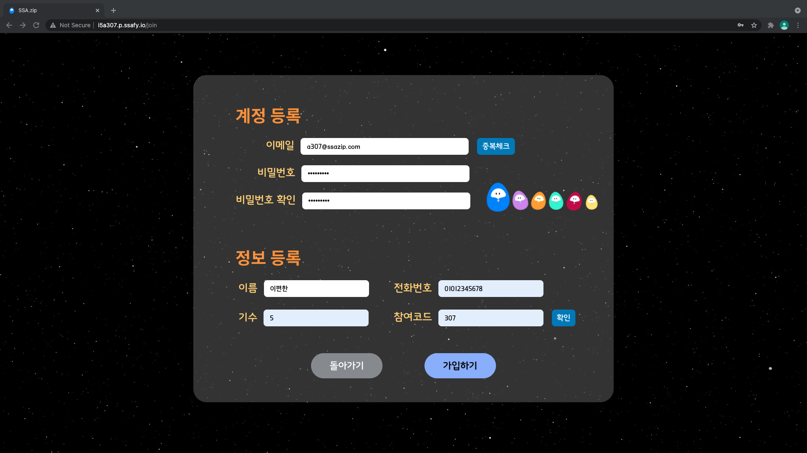

- 회원가입

  1. 이메일 중복체크
  2. 비밀번호는 영문+숫자 8자리
  3. 참여코드 입력 후 확인

  모두 입력해야 가입 가능합니다.

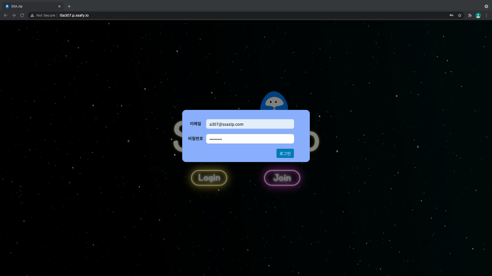

- 로그인

  이메일, 비밀번호를 입력하여 로그인 해주세요.

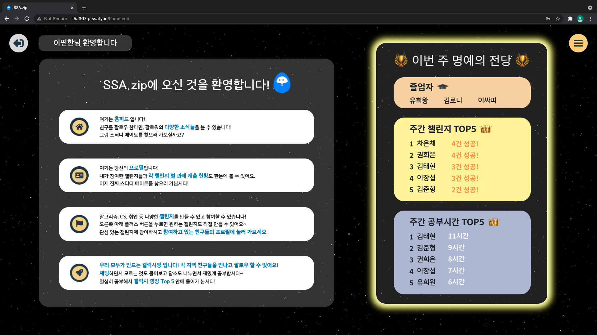

- 피드 페이지(초기 화면)

  회원가입 직후엔 간단한 튜토리얼이 피드에 나타납니다!

  오른쪽 명예의 전당에는 랜덤으로 보여지는 3명의 졸업자, 챌린지 참여 횟수 또는 갤럭시 누적 시간 주간 상위 5인 확인이 가능하며 각 이름을 클릭하면 해당 사용자의 프로필로 이동하실 수 있습니다.

  *주간 TOP5는 매주 월요일 자정에 갱신됩니다.

  

  좌측 상단에 있는 버튼: 로그아웃 버튼

  우측 상단에 있는 버튼: 네비게이션 버튼

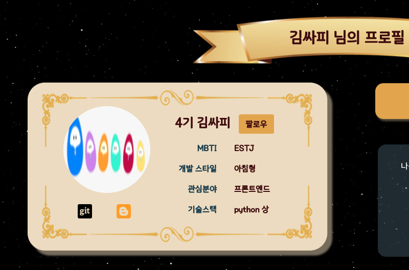

- 팔로우

  다른 사람의 프로필에 방문하여 팔로우 해보세요! 친구의 활동 소식을 피드에서 확인할 수 있습니다.

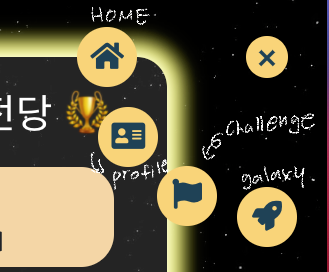

- 네비게이션 버튼

  순서대로 홈(피드), 내 프로필, 챌린지 목록, 갤럭시로 이동할 수 있는 버튼입니다.

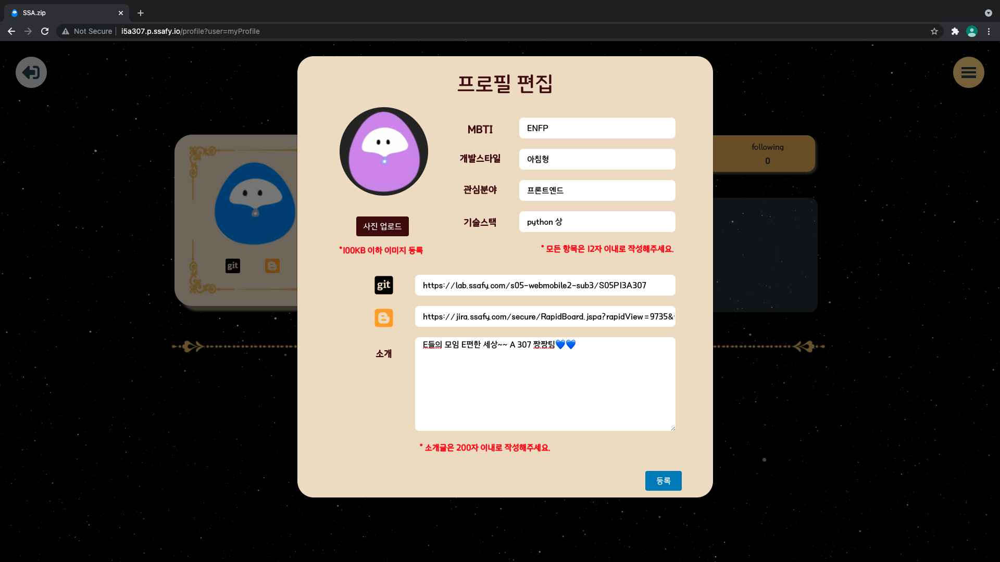

- 내 프로필 편집(프로필 페이지)

  프로필 사진과 나만의 특색있는 정보를 입력하여 프로필 id카드를 꾸밀 수 있습니다!

  프로필 사진은 100kb를, 다른 정보들은 주어진 글자 수를 넘지 않도록 주의해주세요!

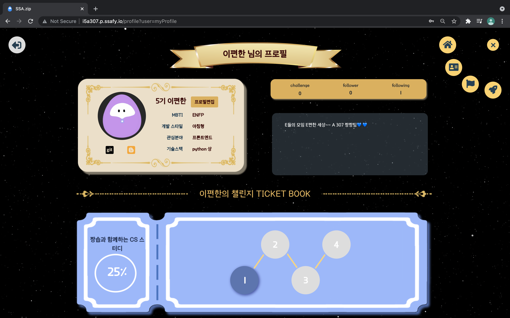

- 프로필 페이지

  프로필을 수정하고, 챌린지에 참여하면 위와 같은 프로필 페이지가 나타납니다!

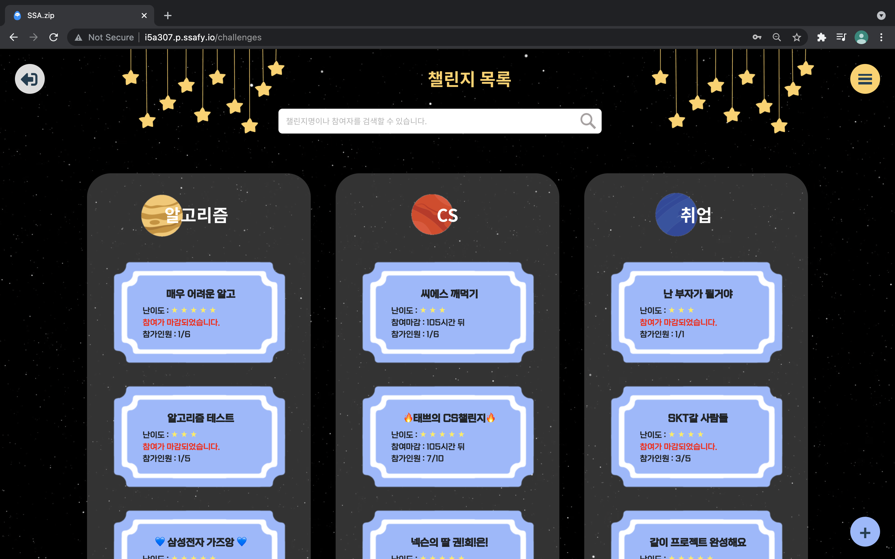

- 챌린지 목록페이지

  각 카테고리별 챌린지 목록을 확인할 수 있습니다! 

  상단의 검색바를 통해 챌린지명 또는 참여자 명으로 챌린지를 검색할 수 있습니다.

  우측 하단의 + 버튼을 눌러 챌린지를 생성할 수 있습니다.

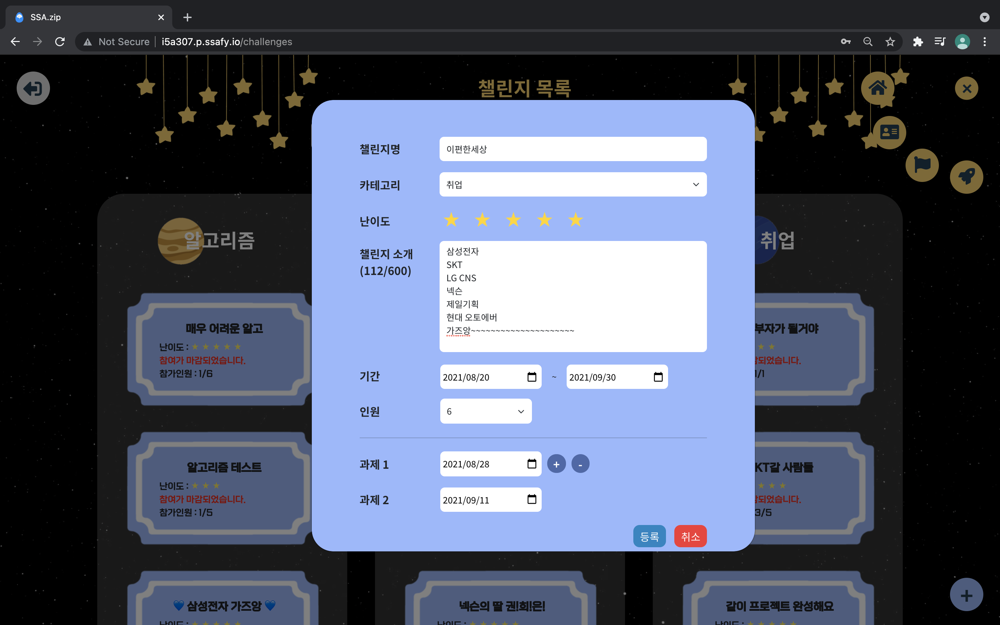

- 챌린지 생성

  챌린지명, 카테고리, 난이도, 챌린지소개, 챌린지 진행 기간, 인원, 그리고 과제별 마감기한을 입력 후 등록 버튼을 눌러 챌린지를 생성할 수 있습니다! 챌린지를 생성하면 자동으로 해당 챌린지의 팀장이 됩니다!

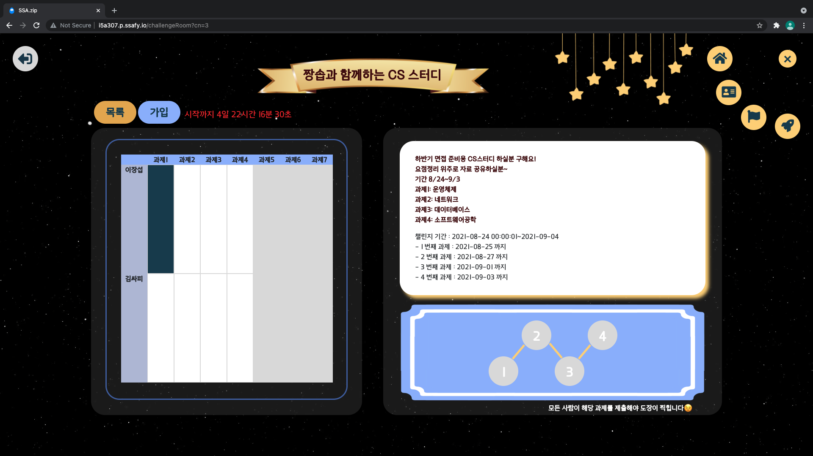

- 챌린지 상세 페이지

  가입버튼을 눌러 해당 챌린지에 참여할 수 있습니다. 

  좌측에는 참여 멤버들의 과제 제출 현황을 볼 수 있는 Bullet Journal이 있습니다. 여기서 다른 사람들의 과제를 열람할 수 있습니다.

  우측에는 챌린지와 과제들에 대한 설명, 과제별 기한, 참여 멤버, 정원, 난이도, 그리고 참여자들의 달성률을 보여주는 티켓이 나타납니다.

  참여 멤버들을 클릭하여 프로필에 방문해보세요!

- 챌린지 가입 완료 후

  챌린지에 성공적으로 가입하셨다면, 위의 사진과 같이 나의 bullet journal이 추가된 모습을 보실 수 있습니다. 여기서 제출할 과제의 칸을 눌러 과제를 제출해보세요! 

  참고로 파란색 칸은 제출완료, 하얀색 칸은 과제 마감기간이 지나지 않은 미제출 상태, 마지막으로 빨간색 칸은 기간이 지난 미제출 상태를 나타냅니다!

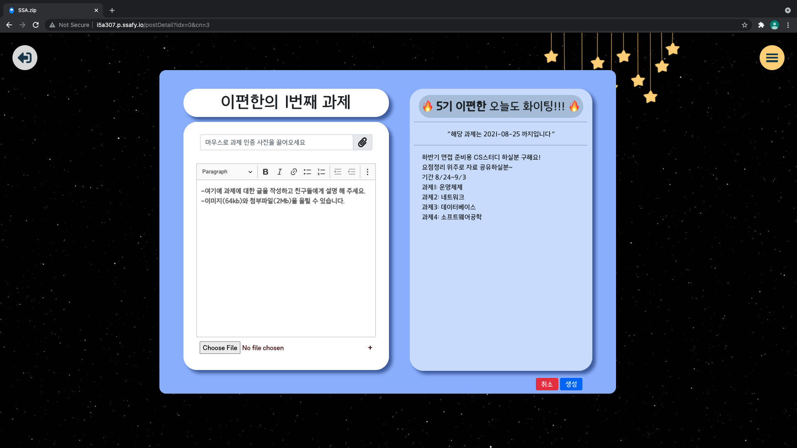

- 과제제출

  과제를 제출하는 화면입니다. 과제의 내용을 입력하고, 첨부할 사진이나 파일이 있다면 함께 제출해주세요. 사진은 100KB, 파일은 2MB를 넘지 않도록 주의해 주세요!

  다 작성 후 '생성' 버튼을 누르면 제출 완료!

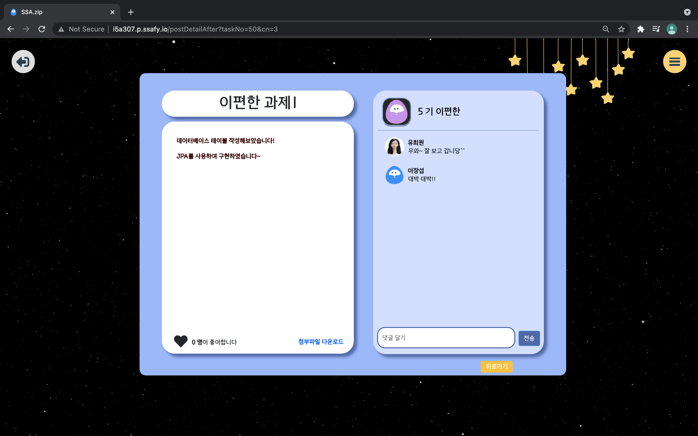

- 제출 후 모습

  제출한 과제를 열면 제출한 내용과 첨부파일을 확인할 수 있습니다.

  우측에 댓글을 남겨 서로 응원해주세요!

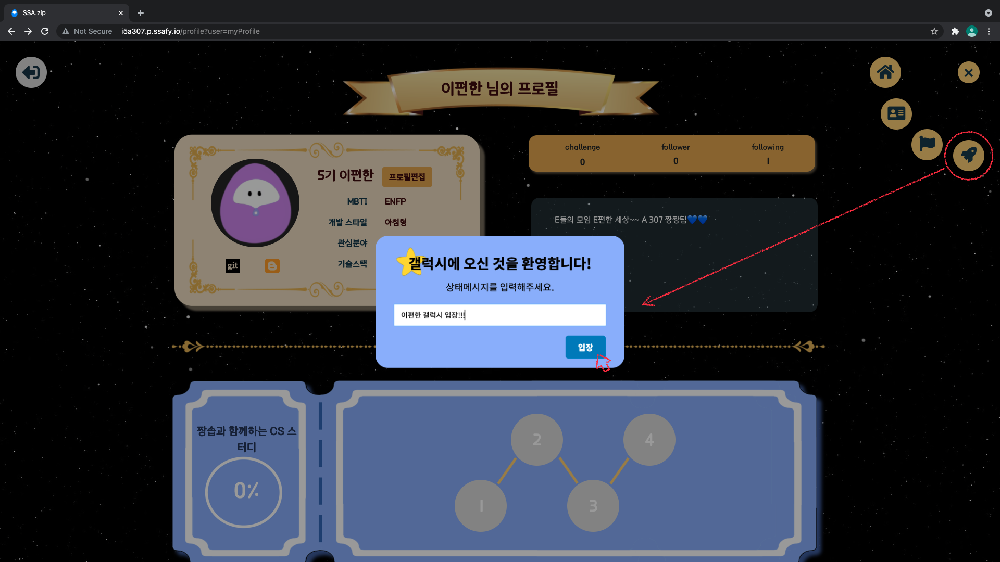

- 갤럭시 입장

  내비게이션-우주선 모양의 버튼을 클릭하여 갤럭시로 입장할 수 있습니다. 입장 전, 나의 팔로워들의 피드에 나타낼 상태메세지를 입력하신 후 입장해주세요!

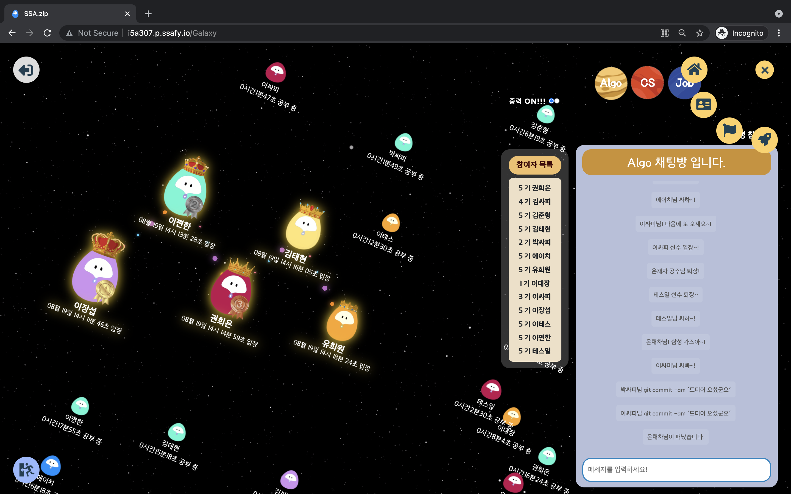

- 갤럭시 페이지

  입장 후 모습입니다. 들어온 순서대로 왕좌에 앉을 수 있습니다. 

  참여자 목록에서 이름을 누르면 새창으로 프로필 페이지가 열립니다.

  우측의 Algo, CS, Job 탭을 눌러 채팅방을 이동할 수 있고 참여자들과 채팅을 할 수 있습니다.

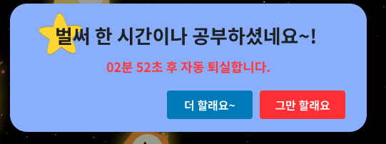

- 세션 갱신

  한시간 주기로 잘 공부하고 있는지, 계속 공부할 것인지 체크하는 창이 뜹니다. 이 창은 약 3분동안 나타나있고, 시간이 지나면 자동으로 갤럭시에서 나오게 되니 이 점 참고해주세요!

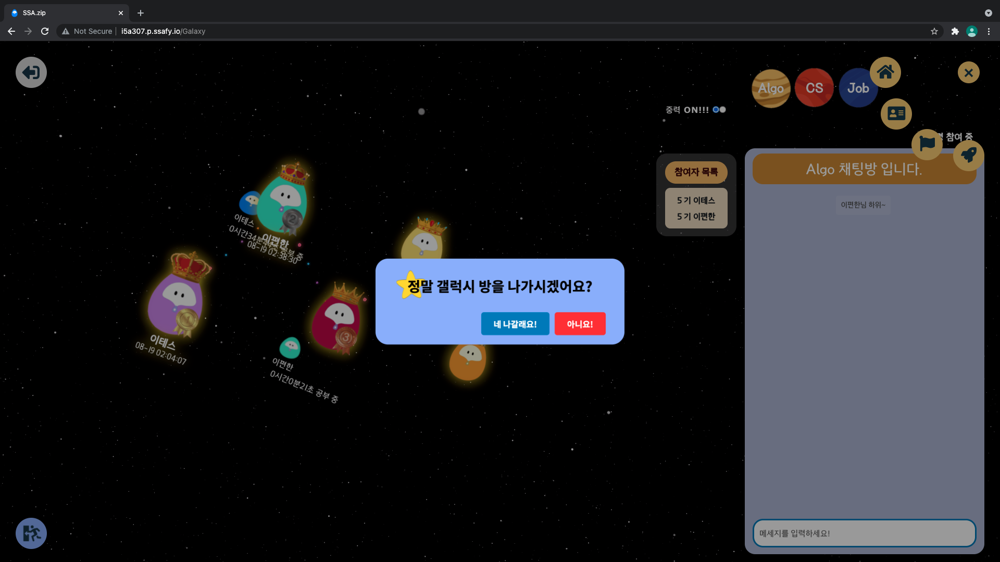

- 갤럭시 퇴장

  좌측 하단에 있는 버튼을 누르면 홈으로 이동하고, 그 외에 다른 버튼들을 눌러서 이동할수도 있습니다. 하지만 이 페이지를 벗어날 경우 공부시간 기록은 멈추게 되며 재입장 후에는 다시 0부터 시간을 잰다는 점 참고해주세요!
